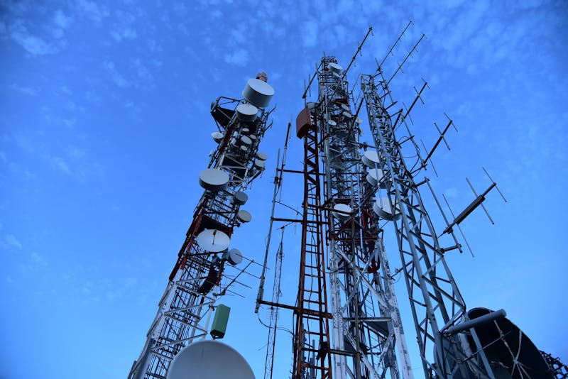
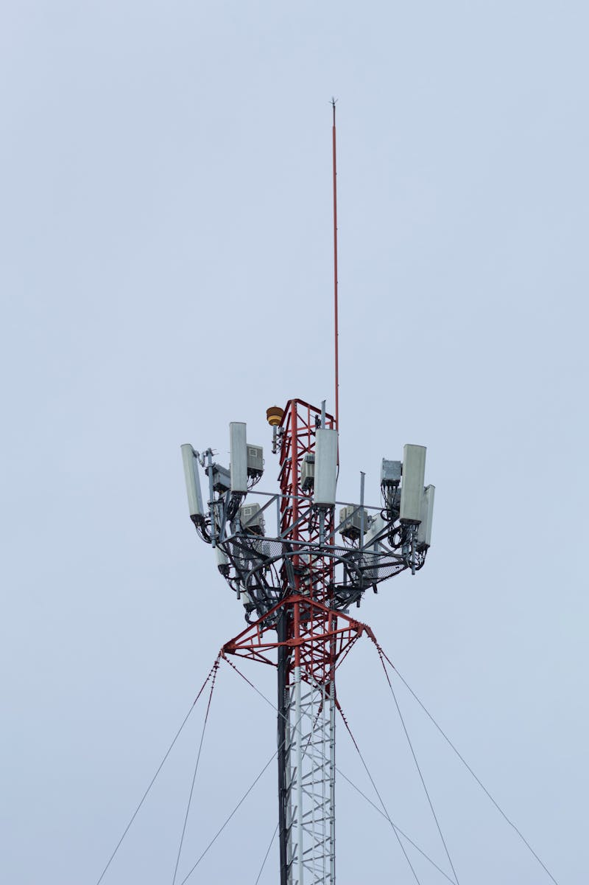
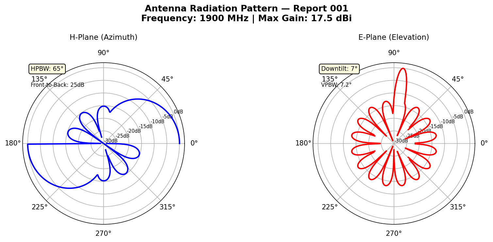
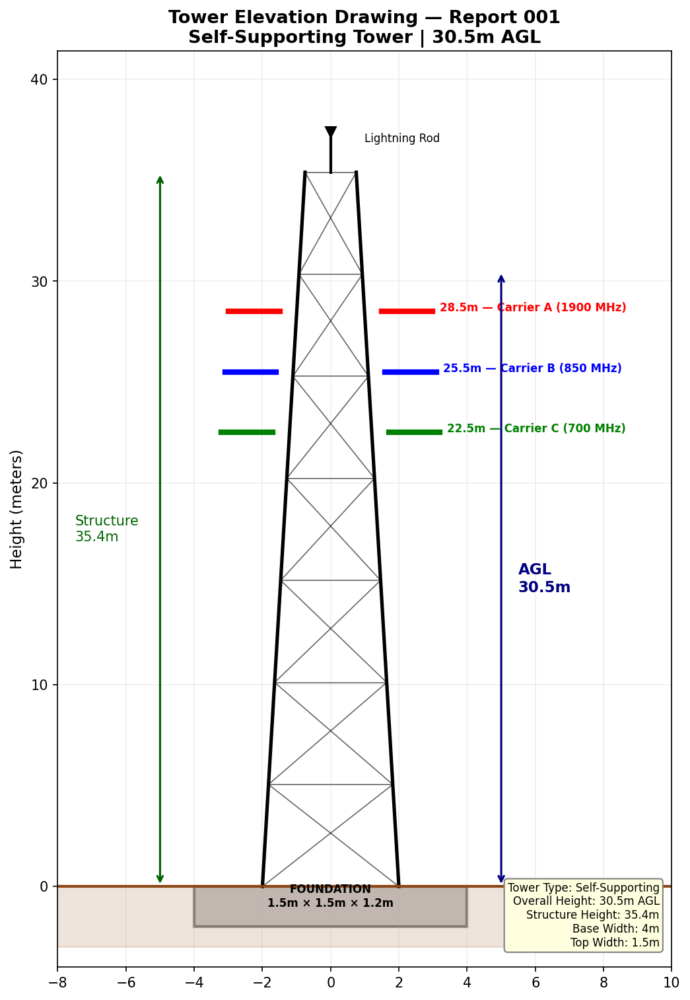
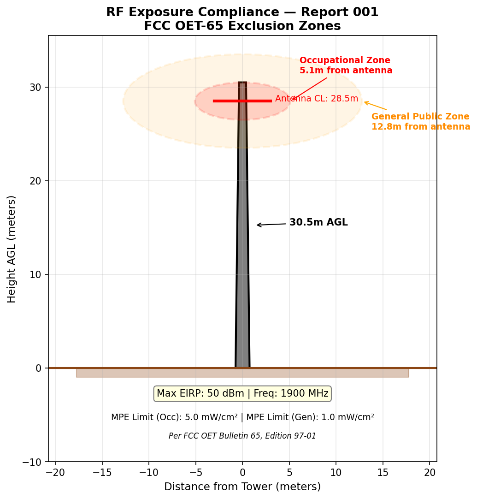
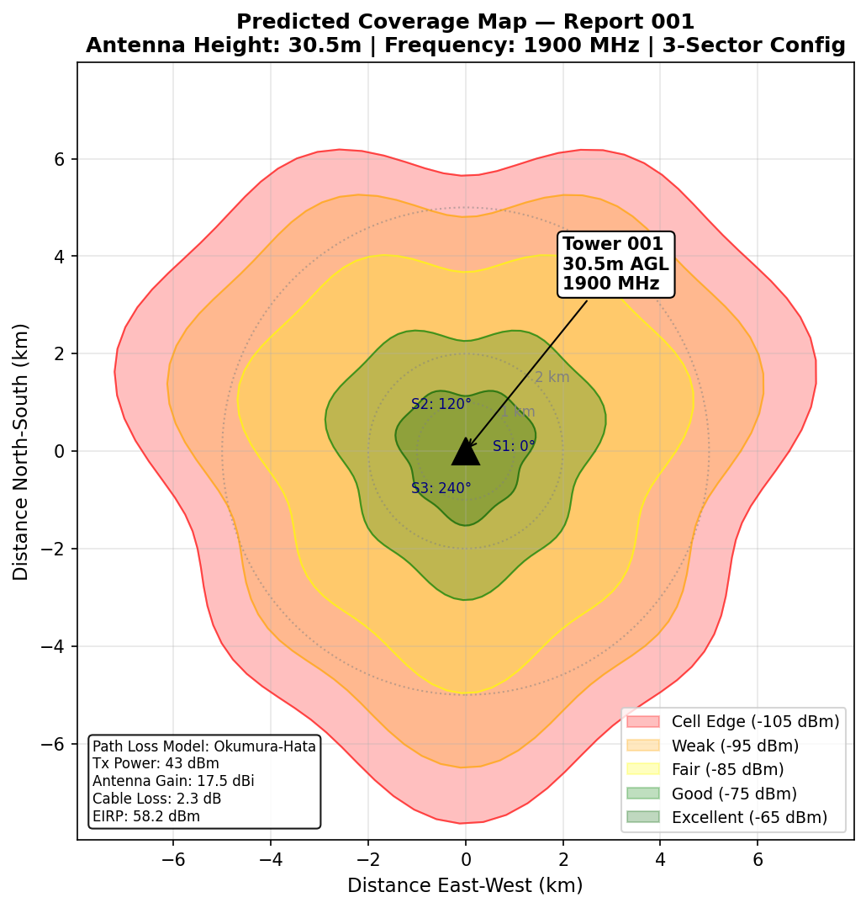

# Tower Inspection Report

| Field | Details |
|---|---|
| **Report ID** | TIR-2025-001 |
| **FCC ASR Number** | A0723570 |
| **Owner** | AT&T Mobility LLC |
| **Location** | 5 miles NW of Kimberly, Kimberly, NV |
| **Coordinates** | Lat 39.315056, Lon -115.089417 |
| **Tower Type** | Self-Supporting Tower |
| **Overall Height (AGL)** | 30.5 m |
| **Structure Height** | 35.4 m |
| **Registration Status** | ✅ Active — Compliant |
| **Registration Date** | 04/05/2011 |
| **FAA Study Number** | 2011-AWP-188-OE |
| **Inspection Date** | 2025-01-15 |
| **Inspector** | M. Rodriguez |

---

## Structural Assessment

Overall structural integrity is satisfactory. All bolted connections inspected and found secure. No visible deformation or buckling in leg members. Foundation grout intact with no signs of settlement.

## Visual Inspection — Tower Base

## Visual Inspection — Antenna Mounts

## Grounding & Lightning Protection

Grounding system tested — resistance measured at 2.8 Ω (within specification < 5 Ω). Lightning protection system installed and operational.

## Summary

Tower is in good operational condition. No corrective actions required. Next scheduled inspection: 2025-07-15.
---

*Data Source: [FCC Antenna Structure Registration (ASR) Database](https://www.fcc.gov/wireless/systems-utilities/antenna-structure-registration) — U.S. Federal Communications Commission. Tower registration data is public record.*

## Technical Documentation

### Antenna Radiation Pattern

*H-plane and E-plane radiation patterns for 1900 MHz sector antenna. H-plane shows 65° half-power beamwidth (HPBW) with 25 dB front-to-back ratio. E-plane shows 7° electrical downtilt with 7.2° vertical beamwidth.*

### Tower Elevation Drawing

*Self-supporting tower elevation drawing showing 30.5m AGL overall height with 35.4m structure height. Three carrier antenna mounting positions at 28.5m, 25.5m, and 22.5m. Foundation dimensions: 1.5m × 1.5m × 1.2m.*

### RF Exposure Compliance

*FCC OET-65 RF exposure compliance zones. Occupational exclusion zone extends 5.1m from antenna face. General public exclusion zone: 12.8m. Maximum EIRP: 49 dBm at 1900 MHz.*

### Predicted Coverage Map

*Okumura-Hata path loss model coverage prediction. 3-sector configuration at 1900 MHz. Signal levels range from -65 dBm (excellent) at tower base to -105 dBm (cell edge). Tx Power: 43 dBm, Antenna Gain: 17.5 dBi.*
