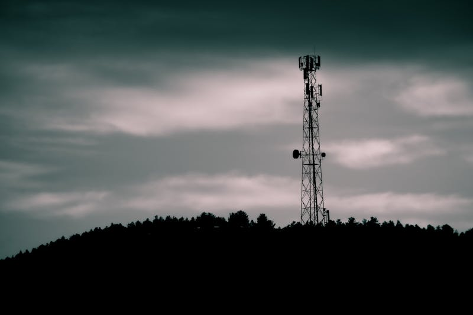
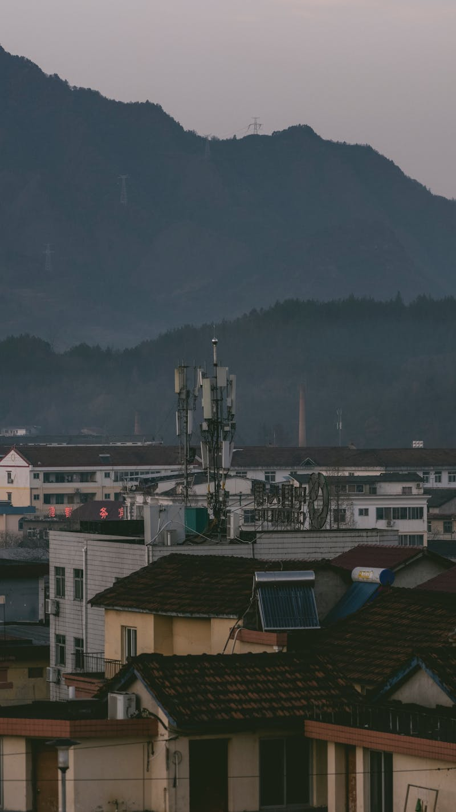
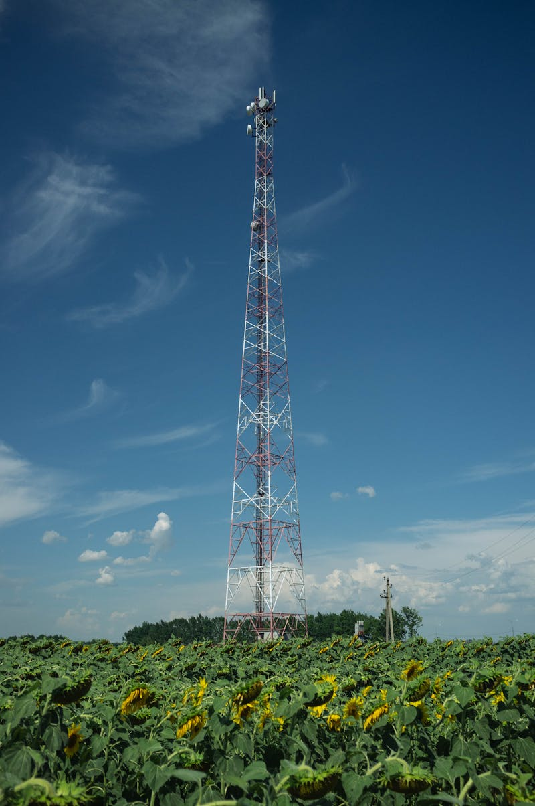
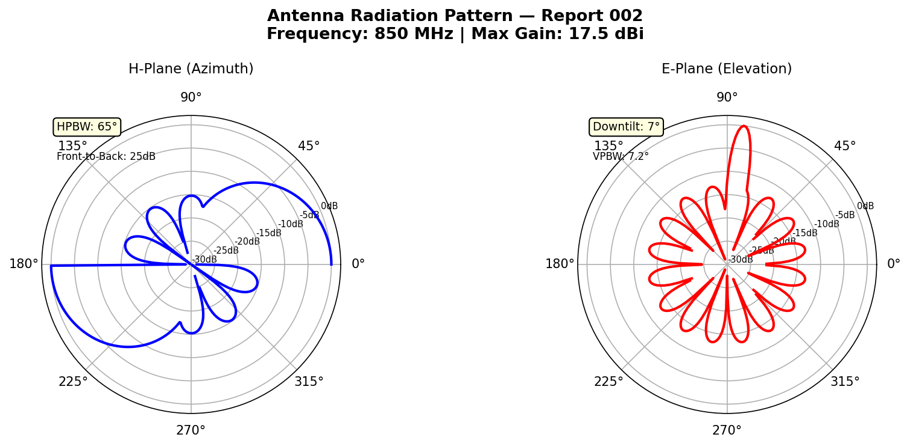
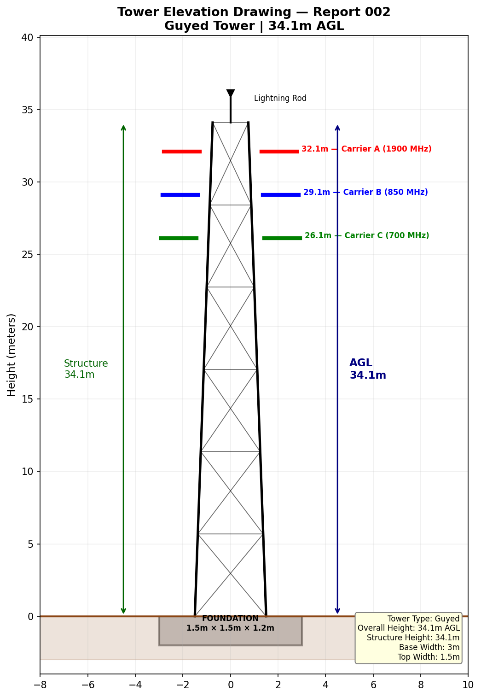
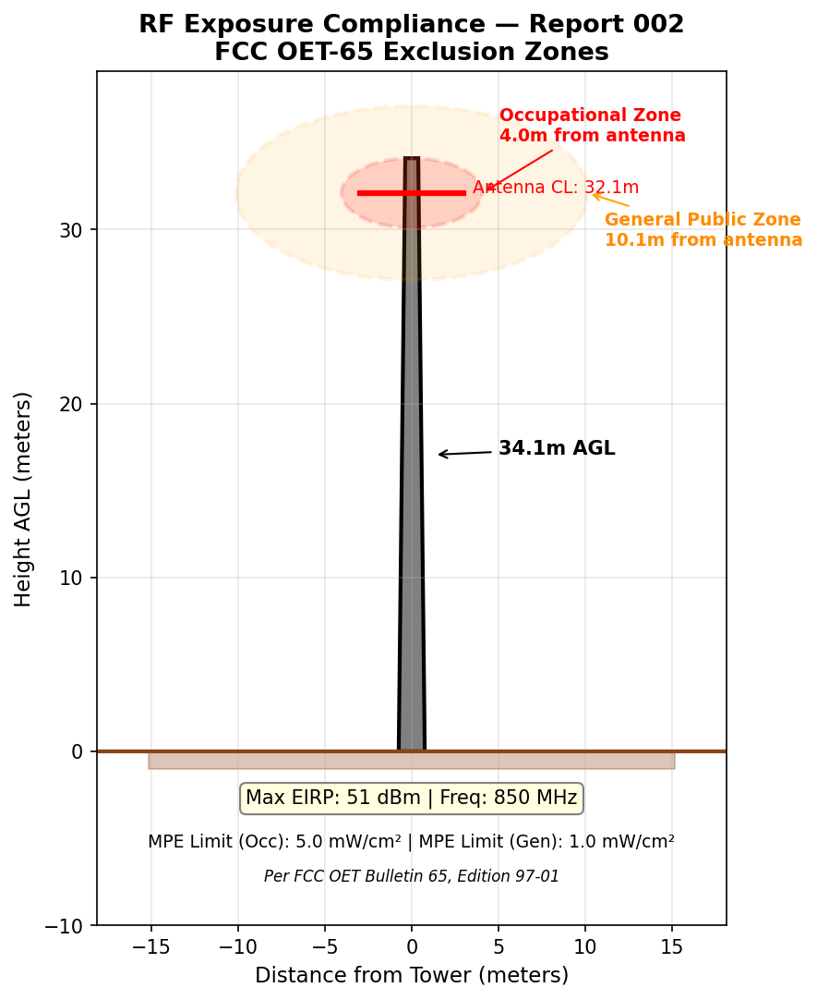
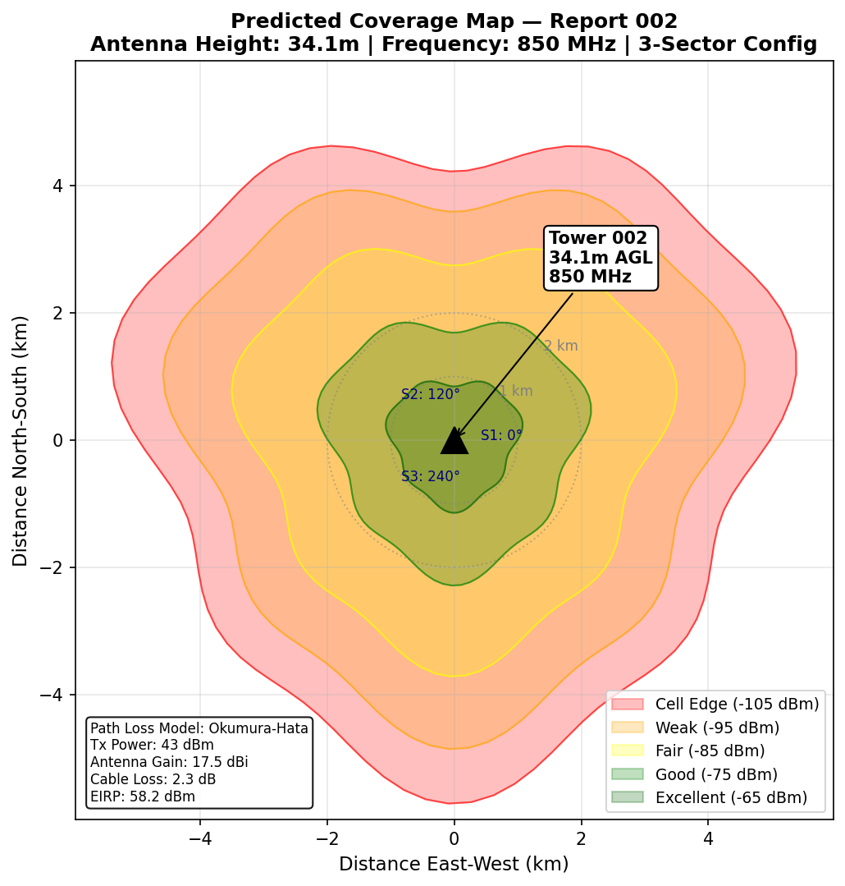

# Tower Inspection Report

| Field | Details |
|---|---|
| **Report ID** | TIR-2025-002 |
| **FCC ASR Number** | A0028075 |
| **Owner** | AT&T WIRELESS SERVICES |
| **Location** | NORTHLINE & HURRON, RIVER ROMULUS, MI |
| **Coordinates** | Lat 42.215278, Lon -83.411111 |
| **Tower Type** | Pole |
| **Overall Height (AGL)** | 34.1 m |
| **Structure Height** | 34.1 m |
| **Registration Status** | ✅ Active — Compliant |
| **Registration Date** | 06/23/1997 |
| **FAA Study Number** | 96-AGL-3660-OE |
| **Inspection Date** | 2025-02-03 |
| **Inspector** | J. Kowalski |

---

## Structural Assessment

Pole structure is in acceptable condition. Minor surface corrosion noted at base plate. All mounting hardware torqued to specification. Foundation appears stable with no visible cracking.

## Visual Inspection — Foundation

## Visual Inspection — Structural Members

## Visual Inspection — Splice Connections

## Grounding & Lightning Protection

Grounding resistance: 4.1 Ω (within spec). Ground rod connections inspected — one connection requires cleaning and re-bonding.

## Summary

Minor maintenance items identified. Ground bond remediation recommended within 60 days. **Priority: MEDIUM**. Next scheduled inspection: 2025-08-03.
---

*Data Source: [FCC Antenna Structure Registration (ASR) Database](https://www.fcc.gov/wireless/systems-utilities/antenna-structure-registration) — U.S. Federal Communications Commission. Tower registration data is public record.*

## Technical Documentation

### Antenna Radiation Pattern

*H-plane and E-plane radiation patterns for 850 MHz sector antenna. Lower frequency provides wider coverage lobe. HPBW: 65° azimuth, 7.2° elevation with 7° mechanical downtilt.*

### Tower Elevation Drawing

*Guyed tower elevation drawing showing 34.1m AGL height. Antenna mounting positions at 32.1m, 29.1m, and 26.1m. Cross-bracing at 5m intervals with diagonal members.*

### RF Exposure Compliance

*FCC OET-65 exclusion zones for 850 MHz operation. Occupational zone: 4.1m. General public zone: 10.1m. MPE limits: 5.0 mW/cm² (occupational), 1.0 mW/cm² (general public).*

### Predicted Coverage Map

*Coverage prediction at 850 MHz showing extended range due to lower frequency propagation. Cell edge at approximately 5 km with -105 dBm threshold. EIRP: 58.2 dBm.*
