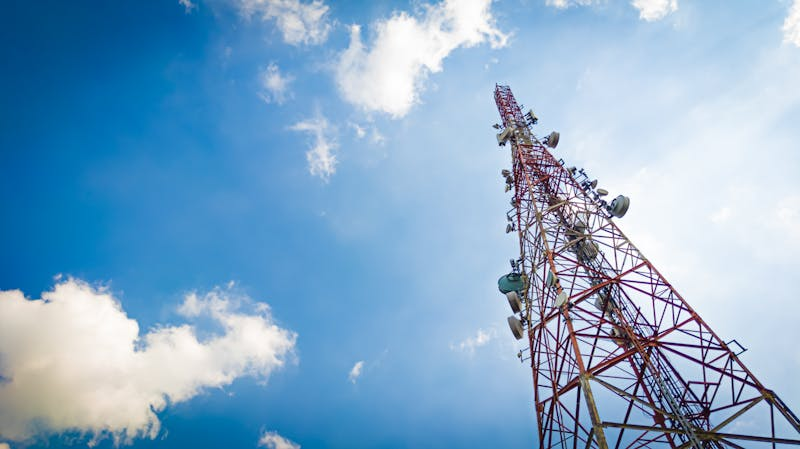
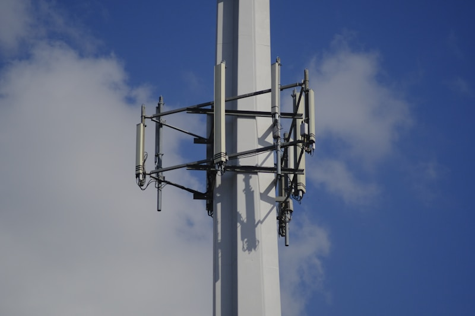
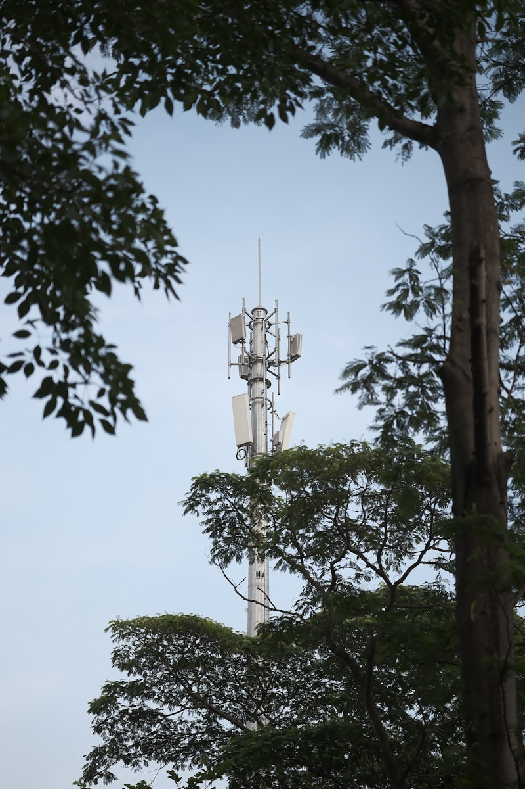
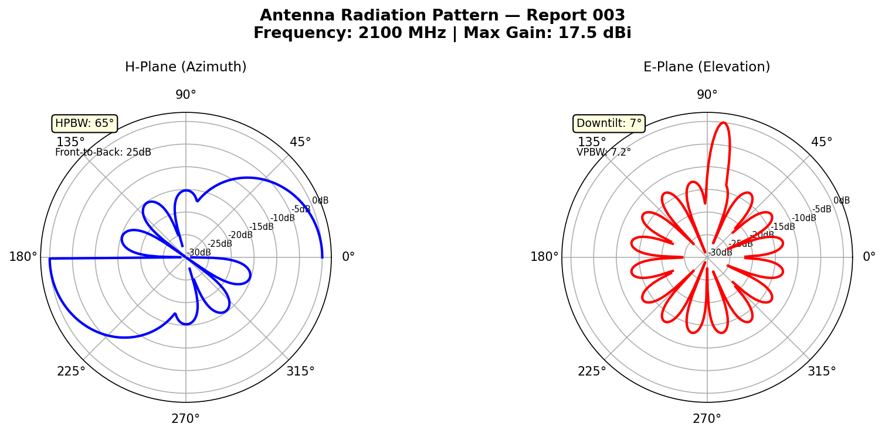
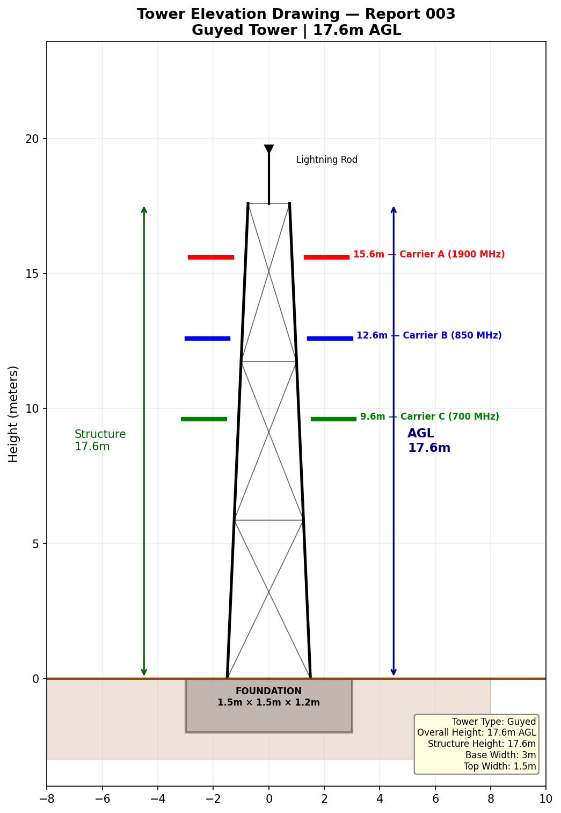
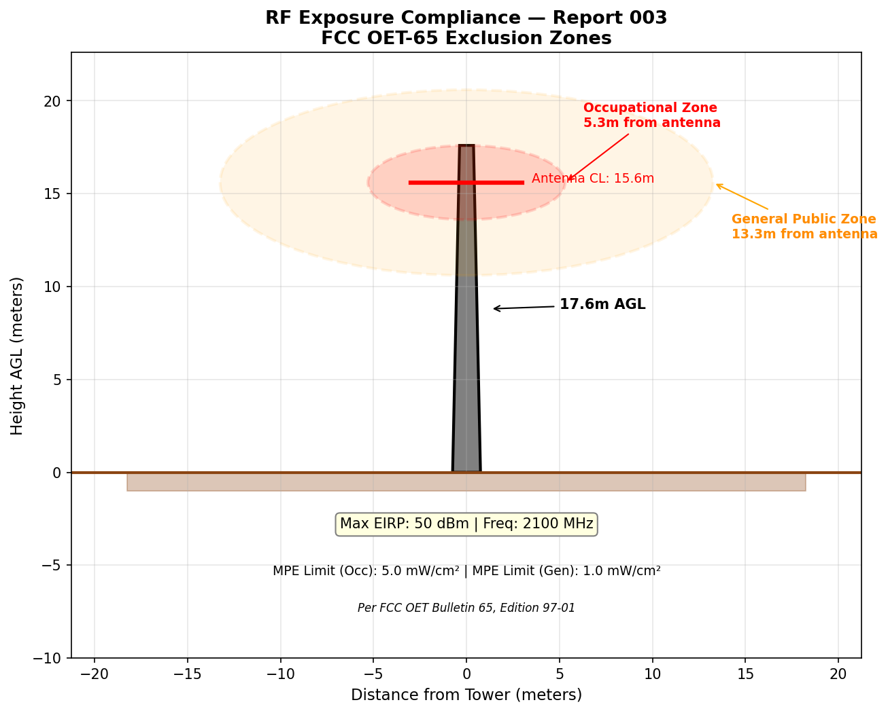
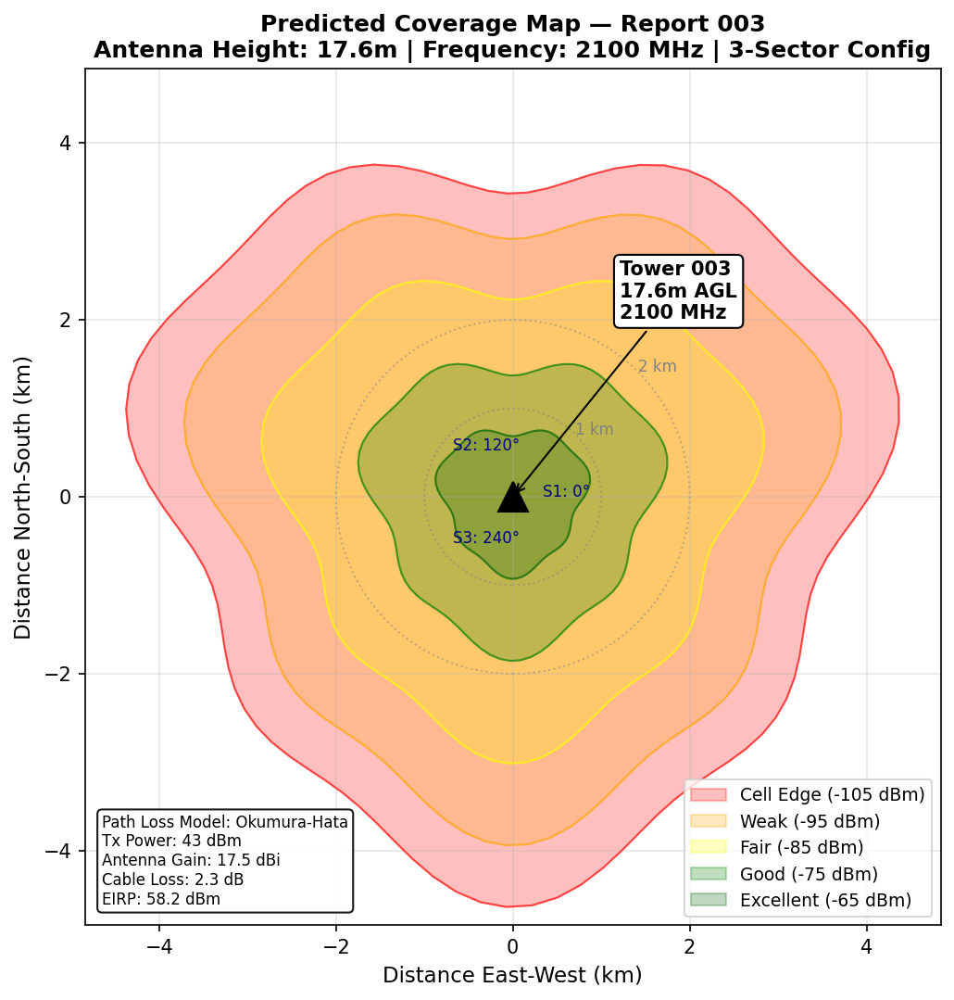

# Tower Inspection Report

| Field | Details |
|---|---|
| **Report ID** | TIR-2025-003 |
| **FCC ASR Number** | A1345977 |
| **Owner** | AT&T Mobility Services LLC |
| **Location** | 454 West Baseline Road, Claremont, CA |
| **Coordinates** | Lat 34.120694, Lon -117.721944 |
| **Tower Type** | Monopole |
| **Overall Height (AGL)** | 17.6 m |
| **Structure Height** | 17.6 m |
| **Registration Status** | 🔄 Construction Permit Issued |
| **Registration Date** | 09/30/2025 |
| **FAA Study Number** | 2014-AWP-9201-OE |
| **Inspection Date** | 2025-01-28 |
| **Inspector** | D. Thompson |

---

## Structural Assessment

Guyed tower structure shows signs of wear at multiple guy wire anchor points. Two anchor points require re-tensioning. Turnbuckle at Anchor Point 3 (northeast) exhibits early-stage corrosion. Overall tower plumbness within tolerance.

## Visual Inspection — Guy Wire Anchors

## Visual Inspection — Tower Mid-Section

## Visual Inspection — Obstruction Lighting

**Corrective Actions Required:**

- Replace turnbuckle at Anchor Point 3 — corrosion exceeds acceptable limits
- Re-tension guy wires to specification (1,800 kgf)
- Repaint horizontal braces between 60–80m levels — paint flaking and surface corrosion observed
- Replace mid-level obstruction light (non-functional) — FAA compliance requirement

## Grounding & Lightning Protection

Grounding resistance: 3.5 Ω (within spec). Lightning arrestor operational.

## Summary

Tower requires corrective maintenance: guy wire re-tensioning, corrosion treatment, and obstruction light repair. Accelerated inspection cycle recommended. **Priority: HIGH**. Next scheduled inspection: 2025-04-28.
---

*Data Source: [FCC Antenna Structure Registration (ASR) Database](https://www.fcc.gov/wireless/systems-utilities/antenna-structure-registration) — U.S. Federal Communications Commission. Tower registration data is public record.*

## Technical Documentation

### Antenna Radiation Pattern

*Radiation pattern at 2100 MHz (UMTS/LTE Band 4). Higher frequency yields tighter beam pattern. Front-to-back ratio: 25 dB. Side lobe suppression: -15 dB below main lobe.*

### Tower Elevation Drawing

*Guyed tower elevation — 17.6m AGL height. Compact structure with antenna positions at 15.6m, 12.6m, and 9.6m. Guy wire attachment points at 12m and 6m levels.*

### RF Exposure Compliance

*RF compliance diagram for 2100 MHz. Shorter tower height brings exclusion zones closer to ground level. Occupational zone: 5.3m from antenna. General public zone: 13.3m.*

### Predicted Coverage Map

*Coverage at 2100 MHz — reduced range compared to lower bands. Short tower height limits coverage radius. Suitable for capacity infill in rural areas.*
