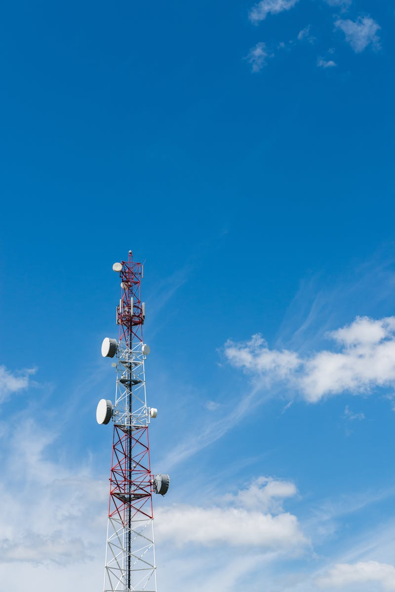
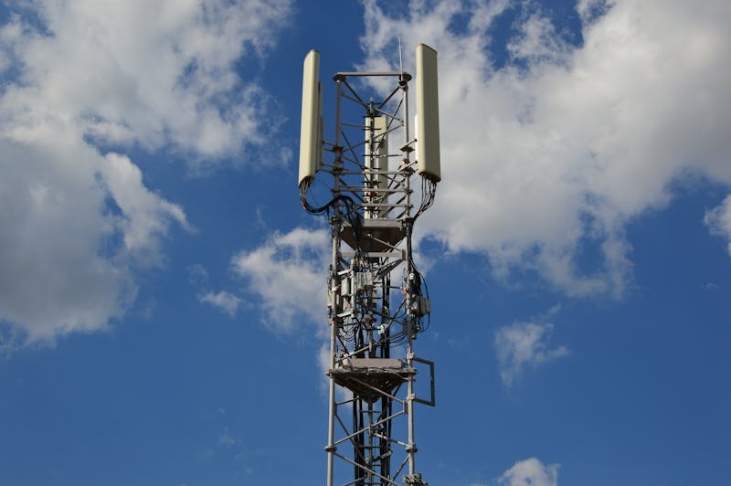
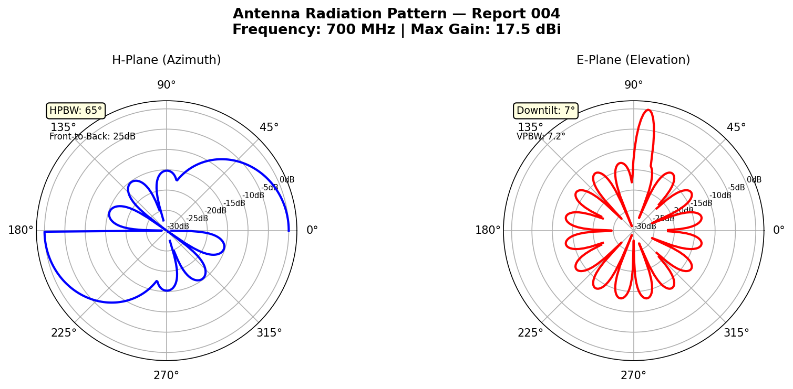
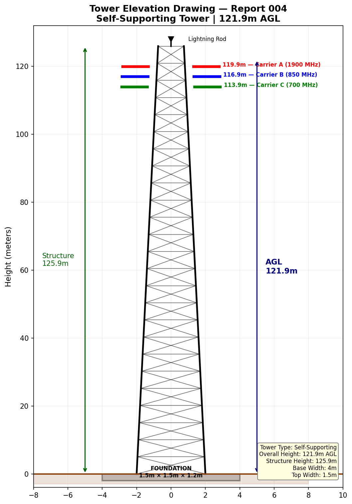
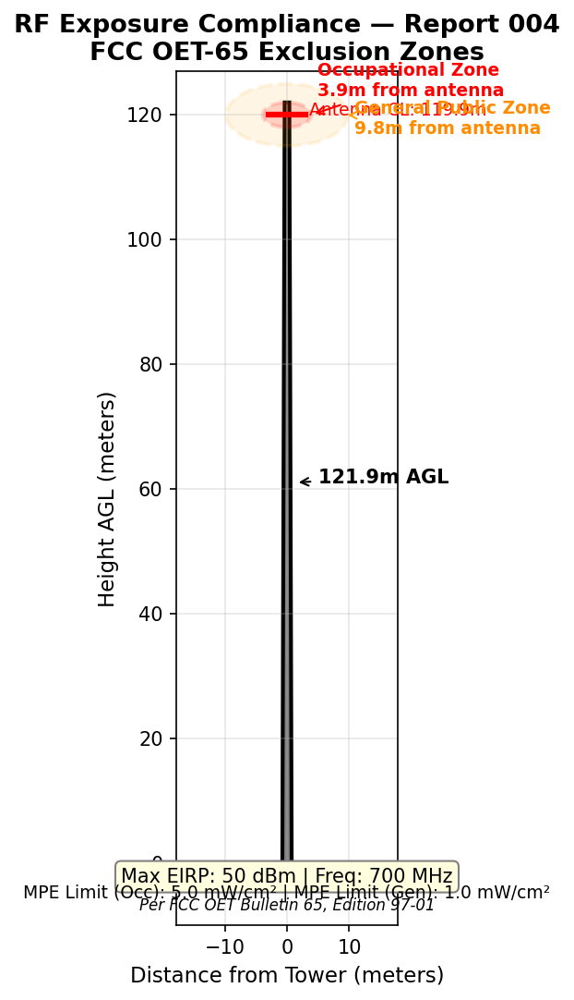
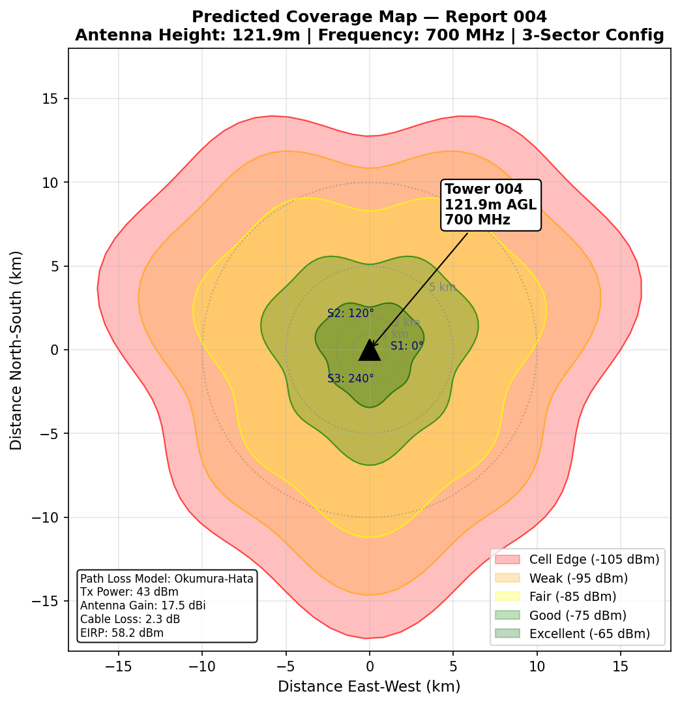

# Tower Inspection Report

| Field | Details |
|---|---|
| **Report ID** | TIR-2025-004 |
| **FCC ASR Number** | A1345314 |
| **Owner** | AT&T Mobility Services LLC |
| **Location** | 137 PLEASANT GROVE ROAD, GAFFNEY, SC |
| **Coordinates** | Lat 34.901417, Lon -81.492833 |
| **Tower Type** | Guyed Tower |
| **Overall Height (AGL)** | 121.9 m |
| **Structure Height** | 125.9 m |
| **Registration Status** | 🔄 Construction Permit Issued |
| **Registration Date** | 09/30/2025 |
| **FAA Study Number** | 2002-ASO-6894-OE |
| **Inspection Date** | 2025-02-10 |
| **Inspector** | S. Patel |

---

## Structural Assessment

Building-mounted tower section is structurally sound. Roof penetration seals intact — no water intrusion observed. Tower-to-building attachment bolts inspected and torqued. Building roof membrane in acceptable condition around tower base.

## Visual Inspection — Equipment Shelter

## Visual Inspection — Tower Surface

## Grounding & Lightning Protection

Grounding system tested — resistance measured at 1.9 Ω (excellent). Bonding to building steel verified.

## Summary

Tower and building mount are in good condition. Equipment shelter operational. No corrective actions required at this time. Next scheduled inspection: 2025-08-10.
---

*Data Source: [FCC Antenna Structure Registration (ASR) Database](https://www.fcc.gov/wireless/systems-utilities/antenna-structure-registration) — U.S. Federal Communications Commission. Tower registration data is public record.*

## Technical Documentation

### Antenna Radiation Pattern

*700 MHz radiation pattern (LTE Band 12/17). Low-band provides excellent building penetration and wide area coverage. HPBW: 65° azimuth, downtilt optimized for 121.9m tower height.*

### Tower Elevation Drawing

*Self-supporting tower elevation — 121.9m AGL (125.9m structure height). Tallest tower in portfolio. Multiple carrier positions with 3m vertical spacing. Wide base: 4m tapering to 1.5m at top.*

### RF Exposure Compliance

*RF compliance for 700 MHz at 121.9m. High antenna placement creates large ground-level clearance. Occupational zone: 3.9m. General public zone: 9.8m. Compliance margin excellent at ground level.*

### Predicted Coverage Map

*700 MHz coverage from 121.9m tower — maximum range configuration. Excellent propagation characteristics provide coverage to ~15 km cell edge. Ideal for rural macro coverage.*
