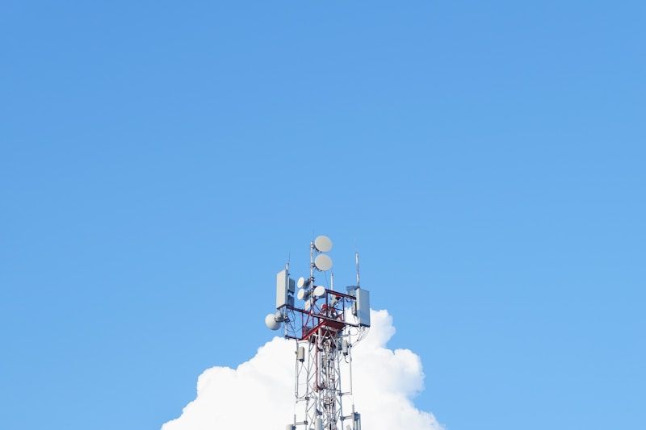
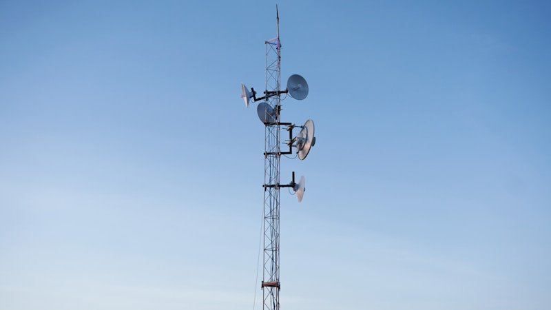
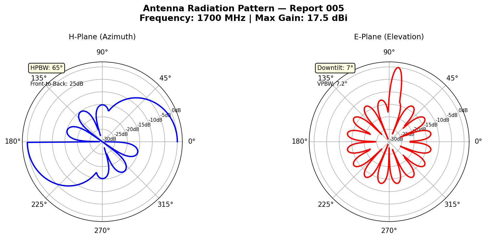
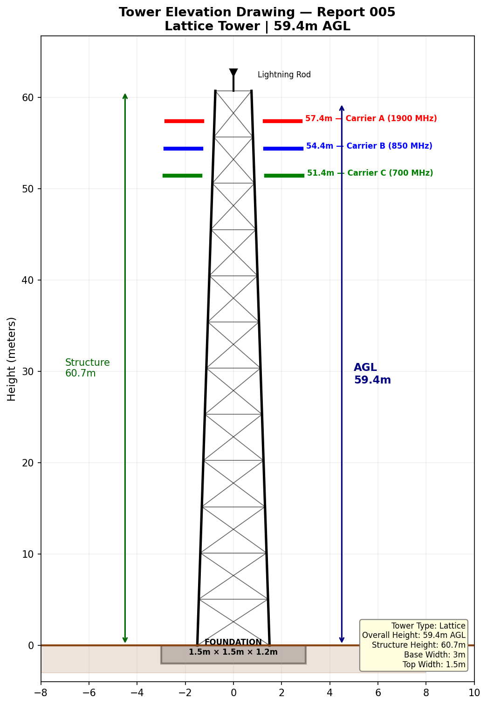
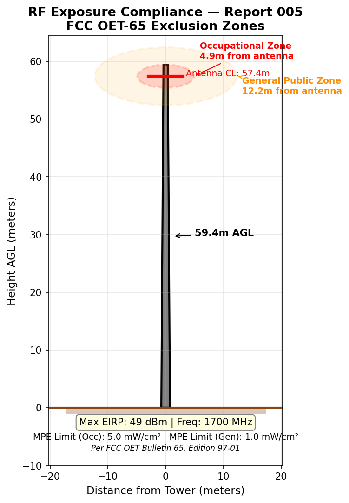
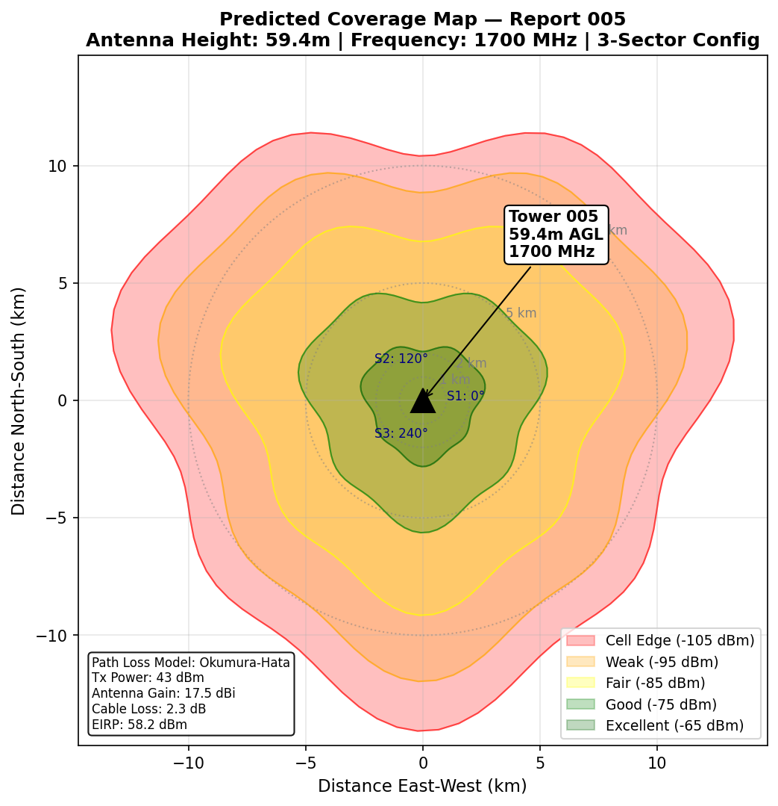

# Tower Inspection Report

| Field | Details |
|---|---|
| **Report ID** | TIR-2025-005 |
| **FCC ASR Number** | A1345937 |
| **Owner** | AT&T Mobility Services LLC |
| **Location** | 94 Angel Lane (WV283D), Kenova, WV |
| **Coordinates** | Lat 38.352139, Lon -82.514139 |
| **Tower Type** | Lattice Tower |
| **Overall Height (AGL)** | 59.4 m |
| **Structure Height** | 60.7 m |
| **Registration Status** | 🔄 Construction Permit Issued |
| **Registration Date** | 09/30/2025 |
| **FAA Study Number** | 2013-AEA-3668-OE |
| **Inspection Date** | 2025-02-18 |
| **Inspector** | K. Williams |

---

## Structural Assessment

Lattice tower structure generally sound. Cable management requires attention — several cable hangers missing at 30m level, causing cable sag. Antenna mounting brackets secure. Feed line weatherproofing at top connector showing degradation.

## Visual Inspection — Cable Routing

## Visual Inspection — Antenna Configuration

## Grounding & Lightning Protection

Grounding resistance: 3.8 Ω (within spec but trending upward from previous reading of 2.9 Ω). Recommend ground rod assessment at next cycle.

## Summary

Cable management remediation and weatherproofing repairs needed. Ground system showing degradation trend — schedule ground rod assessment. **Priority: MEDIUM**. Next scheduled inspection: 2025-06-18.
---

*Data Source: [FCC Antenna Structure Registration (ASR) Database](https://www.fcc.gov/wireless/systems-utilities/antenna-structure-registration) — U.S. Federal Communications Commission. Tower registration data is public record.*

## Technical Documentation

### Antenna Radiation Pattern

*1700 MHz (AWS) radiation pattern for lattice tower deployment. Mid-band frequency balances coverage and capacity. 65° sector beamwidth with 7° electrical downtilt.*

### Tower Elevation Drawing

*Lattice tower elevation — 59.4m AGL (60.7m structure). Antenna mounts at 57.4m, 54.4m, and 51.4m. Cable routing path shown along tower leg with cable hangers at 3m intervals.*

### RF Exposure Compliance

*FCC OET-65 compliance zones for 1700 MHz. Occupational exclusion: 4.9m. General public exclusion: 12.3m. EIRP: 48 dBm. Cable loss noted at 30m level may affect actual radiated power.*

### Predicted Coverage Map

*Predicted coverage at 1700 MHz from 59.4m tower. Suburban environment with moderate building density. Coverage radius approximately 8 km to cell edge (-105 dBm).*
